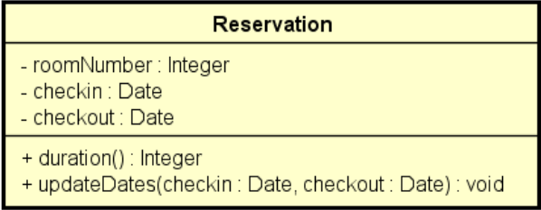

# Problema Exemplo: Hospedagem

Este projeto demonstra a resolução de uma reserva de hotel, utilizando a estrutura try-catch. Existem 3 códigos, com melhorias contínuas:

1. **De uma forma (muito ruim):** lógica de validação no programa principal
   - Lógica de validação não delegada à reserva

2. **De uma forma (ruim):** Método retornando string
   - A semântica da operação é prejudicada
   - Retornar string não tem nada a ver com atualização de reserva
   - E se a operação tivesse que retornar uma string?
   - Ainda não é possível tratar exceções em construtores
   - Ainda não há auxílio do compilador: o programador deve "lembrar" de verificar se houve erro
   - A lógica fica estruturada em condicionais aninhadas

3. **De uma forma (boa):** tratamento de exceções

## Enunciado do Problema

Fazer um programa para ler os dados de uma reserva de hotel (número do quarto, data de entrada e data de saída) e mostrar os dados da reserva, inclusive sua duração em dias. Em seguida, ler novas datas de entrada e saída, atualizar a reserva e mostrar novamente a reserva com os dados atualizados. O programa não deve aceitar dados inválidos para a reserva, conforme as seguintes regras:

- Alterações de reserva só podem ocorrer para datas futuras
- A data de saída deve ser maior que a data de entrada

## Diagrama

